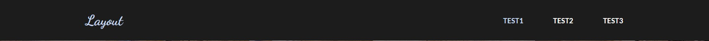
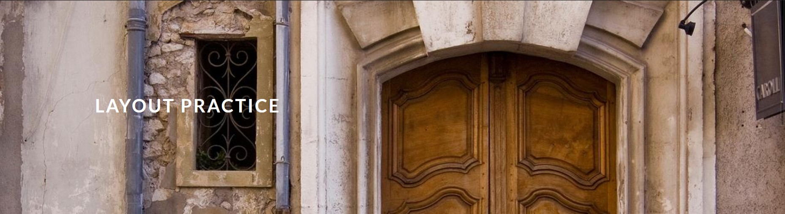
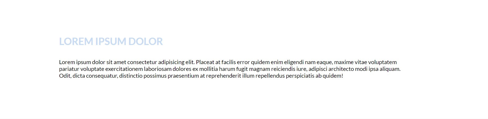
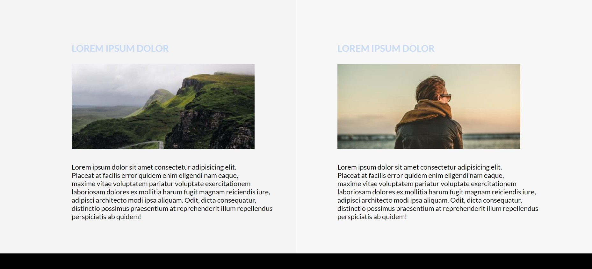

# Layout

<details>
<summary>목차</summary>

- [과제 주제 설명](#과제-주제-설명)
- [주요 코드 설명](#주요-코드-설명)
  - [header](#header)
  - [section](#section)
    - [banner](#banner)
    - [one](#one)
    - [two](#two)
  - [footer](#footer)
- [비고 및 고찰](#비고-및-고찰)

</details>

<br>

## 과제 주제 설명

4주차에 배운 레이아웃 관련된 내용을 활용하여, 웹 페이지의 레이아웃을 잡아 보는 것

<br>
<br>

## 주요 코드 설명

```css
section .inner,
#header .inner,
#footer .inner {
  /* 모든 내용이 들어가는 .inner div에 적용 */
  width: calc(100% - 5em); /* 좌우 빈 공간을 일정하게 적용 */
  margin: 0 auto;
  position: relative;
}
```

### header



```css
#header {
  background: #1c1c1c;
  color: #d5d5d5;
  cursor: default;
  top: 0; /* 상단 고정 */
  left: 0; /* 좌측 고정 */
  line-height: 5em; /* 줄 간격을 늘려 안에 내용 중간 정렬 */
  position: fixed; /* 스크롤을 내려도 위치 고정 */
  text-align: right; /* 텍스트 오른쪽 정렬 */
  width: 100%; /* 좌우 꽉 차게 */
  z-index: 10001;
}
```

### section

- banner



```css
#banner {
  padding: 10em 0 10em 0; /* 배너 이미지 크기 지정 */
  background-image: url("사진 주소"); /* 배너 이미지 지정 */
  background-size: cover; /* 배너 이미지 꽉 차게 */
  text-align: left; /* 텍스트 왼쪽 정렬 */
  z-index: 9999;
}
```

- one



```css
#one {
  padding: 6em 0 6em 0; /* 상단 하단의 빈 공간 적용 */
}
```

- two



```css
#two {
  padding: 6em 0 6em 0; /* 상단 하단의 빈 공간 적용 */
  background: linear-gradient(
    to right,
    #f3f3f3 0%,
    #f3f3f3 50%,
    #f7f7f7 0%,
    #f7f7f7 100%
  ); /* 백그라운드 색 그라데이션 지정 */
}
```

```css
#two .inner {
  display: flex;
  flex-direction: row; /* 컨텐츠 배치를 좌에서 우로 */
}

#two .inner article {
  width: 50%; /* 컨텐츠를 한 라인에 넣기 위해 좌우 크기를 줄임 */
}
```

### footer


```css
#footer {
  background-color: #c8dbf5; /* 백그라운드 색 지정 */
  padding: 3em 0 2em 0; /* 상단 하단의 빈 공간 적용 */
  color: #ffffff; /* 텍스트 색 지정 */
}
```

<br>
<br>

## 비고 및 고찰

HTML, CSS를 통해 웹 페이지 개발을 처음부터 한 적이 거의 없고, 거의 완성되어 있는 코드에서 수정을 하는 식으로 접해왔습니다. 처음으로 이번 과제를 통해 간단하게 처음부터 웹 페이지를 작성하여 레이아웃을 잡아보았는데 어려움을 많이 겪었습니다. 구상을 해도 코드로 표현하는데 시간이 많이 걸렸고, 구상한대로 코드를 작성하여도 원하지 않는 결과가 나올 때도 많았으며 아무 효과가 발생하지 않을 때도 있었습니다. 아직 익숙치 않은 HTML 태그와 CSS의 다양한 기능 사용이 문제였던 것 같습니다. 다양한 실습 및 프로젝트를 통해 경험을 많이 해보면 나아질 것이라고 생각이 듭니다.

이번 과제로 웹 페이지를 개발하면서 flex와 positon 설정을 통해 위치를 잡는 것이 가장 메인이였습니다. flex를 배우고 실제로 사용을 하면서 이게 없었을 땐 레이아웃을 도대체 어떻게 잡은거지란 생각이 들 정도로 강력하고 사용하기 편했습니다.
